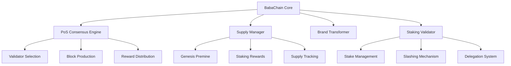

# BabaChain Transformation Design Document

## Overview

This document outlines the technical design for transforming the BabaChain cryptocurrency codebase into BabaChain, a new Proof of Stake blockchain with modified tokenomics and complete rebranding. The transformation involves four major architectural changes:

1. **Complete Rebranding**: All references to "BabaChain" will be replaced with "BabaChain"
2. **Consensus Algorithm Migration**: From Proof of Work (PoW) to Proof of Stake (PoS)
3. **Supply Economics Modification**: Total supply increased from ~21M to 210M coins
4. **Premine Implementation**: 50M coins allocated at genesis for development and marketing

## Architecture

### High-Level System Architecture



### Core Components

#### 1. Brand Transformer
- **Purpose**: Systematic replacement of all BabaChain references with BabaChain
- **Scope**: Source code, file names, directory names, documentation, configuration files
- **Implementation**: Automated script-based transformation with manual verification

#### 2. PoS Consensus Engine
- **Purpose**: Replace PoW mining with PoS validation
- **Key Features**:
  - Validator selection based on stake weight
  - Block production rotation
  - Finality mechanism
  - Fork choice rule

#### 3. Supply Manager
- **Purpose**: Manage the new tokenomics (210M total supply)
- **Components**:
  - Genesis block premine allocation
  - Staking reward calculation
  - Supply cap enforcement
  - Inflation rate management

#### 4. Staking Validator
- **Purpose**: Handle all staking operations
- **Features**:
  - Stake locking/unlocking
  - Validator registration
  - Reward distribution
  - Slashing for malicious behavior

## Components and Interfaces

### 1. Consensus Layer Modifications

#### Current BabaChain PoW Structure
```cpp
// src/pow.cpp - Current implementation
unsigned int GetNextWorkRequired(const CBlockIndex* pindexLast, 
                                const CBlockHeader *pblock, 
                                const Consensus::Params& params);
```

#### New BabaChain PoS Structure
```cpp
// src/pos.cpp - New implementation
class PoSValidator {
public:
    bool ValidateStake(const CBlockIndex* pindexPrev, const CBlock& block);
    CAmount CalculateStakeReward(const CAmount& stakeAmount, int64_t stakeDuration);
    bool SelectNextValidator(const std::vector<CStakeInput>& validators);
};
```

### 2. Chain Parameters Transformation

#### Modified Consensus Parameters
```cpp
struct Params {
    // Existing parameters (renamed)
    uint256 hashBabaChainGenesisBlock;  // was hashGenesisBlock
    
    // New PoS parameters
    int64_t nStakeMinAge;               // Minimum stake age (e.g., 8 hours)
    int64_t nStakeMaxAge;               // Maximum stake age (e.g., 30 days)
    CAmount nMinStakeAmount;            // Minimum stake amount
    int64_t nStakeTargetSpacing;        // Target block time (2.5 minutes)
    
    // Modified supply parameters
    CAmount nMaxSupply;                 // 210,000,000 * COIN
    CAmount nPremineAmount;             // 50,000,000 * COIN
    
    // Removed PoW parameters
    // uint256 powLimit;                // No longer needed
    // int64_t nPowTargetTimespan;      // No longer needed
};
```

### 3. File and Directory Renaming Map

#### Executable Files
- `src/bitcoind.cpp` → `src/babachaind.cpp`
- `src/bitcoin-cli.cpp` → `src/babachain-cli.cpp`
- `src/bitcoin-tx.cpp` → `src/babachain-tx.cpp`
- `src/bitcoin-wallet.cpp` → `src/babachain-wallet.cpp`

#### Resource Files
- `src/babachain-cli-res.rc` → `src/babachain-cli-res.rc`
- `src/babachain-tx-res.rc` → `src/babachain-tx-res.rc`
- `src/babachain-wallet-res.rc` → `src/babachain-wallet-res.rc`
- `src/babachaind-res.rc` → `src/babachaind-res.rc`

#### Configuration and Build Files
- Update all `Makefile.am` references
- Modify `configure.ac` for new binary names
- Update CMakeLists.txt entries

### 4. Network Protocol Changes

#### Network Magic Bytes
```cpp
// Current BabaChain mainnet
pchMessageStart[0] = 0xba;
pchMessageStart[1] = 0xba;
pchMessageStart[2] = 0xc4;
pchMessageStart[3] = 0x1a;

// New BabaChain mainnet
pchMessageStart[0] = 0xba;  // 'ba' for BabaChain
pchMessageStart[1] = 0xba;
pchMessageStart[2] = 0xc4;  // 'c' for chain
pchMessageStart[3] = 0x1a;  // unique identifier
```

#### Port Configuration
```cpp
// Network ports
nDefaultPort = 8999;                    // was 9999
nDefaultPlatformP2PPort = 25656;        // was 26656
nDefaultPlatformHTTPPort = 543;         // was 443
```

#### Address Prefixes
```cpp
// BabaChain addresses start with 'B'
base58Prefixes[PUBKEY_ADDRESS] = std::vector<unsigned char>(1,25);  // was 76 for 'X'
// BabaChain script addresses start with 'C'
base58Prefixes[SCRIPT_ADDRESS] = std::vector<unsigned char>(1,28);  // was 16 for '7'
```

## Data Models

### 1. Stake Transaction Structure
```cpp
class CStakeInput {
public:
    COutPoint prevout;          // Previous output being staked
    CAmount nValue;             // Amount being staked
    int64_t nTime;              // Stake time
    uint256 hashBlock;          // Block hash where stake originates
    
    SERIALIZE_METHODS(CStakeInput, obj) {
        READWRITE(obj.prevout, obj.nValue, obj.nTime, obj.hashBlock);
    }
};

class CStakeOutput {
public:
    CScript scriptPubKey;       // Destination script
    CAmount nValue;             // Stake reward amount
    
    SERIALIZE_METHODS(CStakeOutput, obj) {
        READWRITE(obj.scriptPubKey, obj.nValue);
    }
};
```

### 2. Validator Registry
```cpp
class CValidator {
public:
    CPubKey pubkey;             // Validator public key
    CAmount nStakeAmount;       // Total staked amount
    int64_t nRegistrationTime;  // When validator registered
    bool fActive;               // Validator status
    
    SERIALIZE_METHODS(CValidator, obj) {
        READWRITE(obj.pubkey, obj.nStakeAmount, obj.nRegistrationTime, obj.fActive);
    }
};
```

### 3. Genesis Block Structure
```cpp
// Modified genesis block creation
static CBlock CreateBabaChainGenesisBlock(uint32_t nTime, uint32_t nNonce, 
                                         uint32_t nBits, int32_t nVersion, 
                                         const CAmount& genesisReward) {
    const char* pszTimestamp = "BabaChain Genesis Block - New Era of Proof of Stake";
    
    // Create premine transaction with 50M coins
    CMutableTransaction txNew;
    txNew.nVersion = 1;
    txNew.vin.resize(1);
    txNew.vout.resize(1);
    txNew.vout[0].nValue = 50000000 * COIN;  // 50M premine
    
    // ... rest of genesis block creation
}
```

## Error Handling

### 1. PoS Validation Errors
```cpp
enum class PoSValidationResult {
    VALID,
    INVALID_STAKE_AMOUNT,
    INVALID_STAKE_AGE,
    INVALID_SIGNATURE,
    DOUBLE_SPEND_ATTEMPT,
    INSUFFICIENT_STAKE,
    VALIDATOR_NOT_REGISTERED
};
```

### 2. Supply Management Errors
```cpp
enum class SupplyError {
    SUPPLY_CAP_EXCEEDED,
    INVALID_PREMINE_AMOUNT,
    REWARD_CALCULATION_ERROR,
    INFLATION_RATE_VIOLATION
};
```

### 3. Staking Operation Errors
```cpp
enum class StakingError {
    INSUFFICIENT_BALANCE,
    STAKE_LOCKED,
    MINIMUM_STAKE_NOT_MET,
    VALIDATOR_ALREADY_REGISTERED,
    SLASHING_CONDITION_MET
};
```

## Testing Strategy

### 1. Unit Testing
- **Brand Transformation Tests**: Verify all string replacements are correct
- **PoS Algorithm Tests**: Test validator selection, reward calculation, slashing
- **Supply Management Tests**: Verify premine allocation, supply cap enforcement
- **Network Protocol Tests**: Test new magic bytes, ports, address formats

### 2. Integration Testing
- **Consensus Integration**: Test PoS consensus with existing masternode system
- **Network Integration**: Test peer discovery with new network parameters
- **Wallet Integration**: Test staking operations through wallet interface
- **RPC Integration**: Test all RPC commands work with new branding

### 3. Performance Testing
- **Staking Performance**: Measure validator selection and block production times
- **Network Performance**: Test throughput with PoS consensus
- **Memory Usage**: Monitor memory consumption with staking data structures
- **Synchronization Speed**: Test initial blockchain sync performance

### 4. Security Testing
- **Stake Grinding Attacks**: Test resistance to stake manipulation
- **Nothing-at-Stake**: Verify economic incentives prevent multiple chain voting
- **Long Range Attacks**: Test checkpointing and finality mechanisms
- **Slashing Conditions**: Verify malicious validator detection and punishment

### 5. Regression Testing
- **Existing Functionality**: Ensure all non-consensus features still work
- **Masternode Compatibility**: Test masternode operations with PoS
- **Governance System**: Verify governance proposals and voting still function
- **InstantSend/ChainLocks**: Test compatibility with existing BabaChain features

## Implementation Phases

### Phase 1: Brand Transformation
1. Automated string replacement across codebase
2. File and directory renaming
3. Build system updates
4. Documentation updates

### Phase 2: PoS Infrastructure
1. Implement basic PoS validation logic
2. Create staking transaction types
3. Modify consensus parameters
4. Update network protocol

### Phase 3: Supply Management
1. Implement new genesis block with premine
2. Modify reward calculation algorithms
3. Update supply tracking mechanisms
4. Implement inflation controls

### Phase 4: Integration and Testing
1. Comprehensive testing suite
2. Performance optimization
3. Security auditing
4. Documentation completion

## Migration Strategy

### 1. Testnet Deployment
- Deploy BabaChain testnet for community testing
- Validate all functionality before mainnet launch
- Gather feedback and make necessary adjustments

### 2. Mainnet Launch
- Coordinate with exchanges for new network support
- Provide migration tools for existing BabaChain holders
- Establish initial validator set from premine allocation

### 3. Community Transition
- Educational materials for PoS staking
- Validator onboarding process
- Economic incentive alignment

This design provides a comprehensive roadmap for transforming BabaChain into BabaChain while maintaining system stability and introducing the desired PoS consensus mechanism and modified tokenomics.