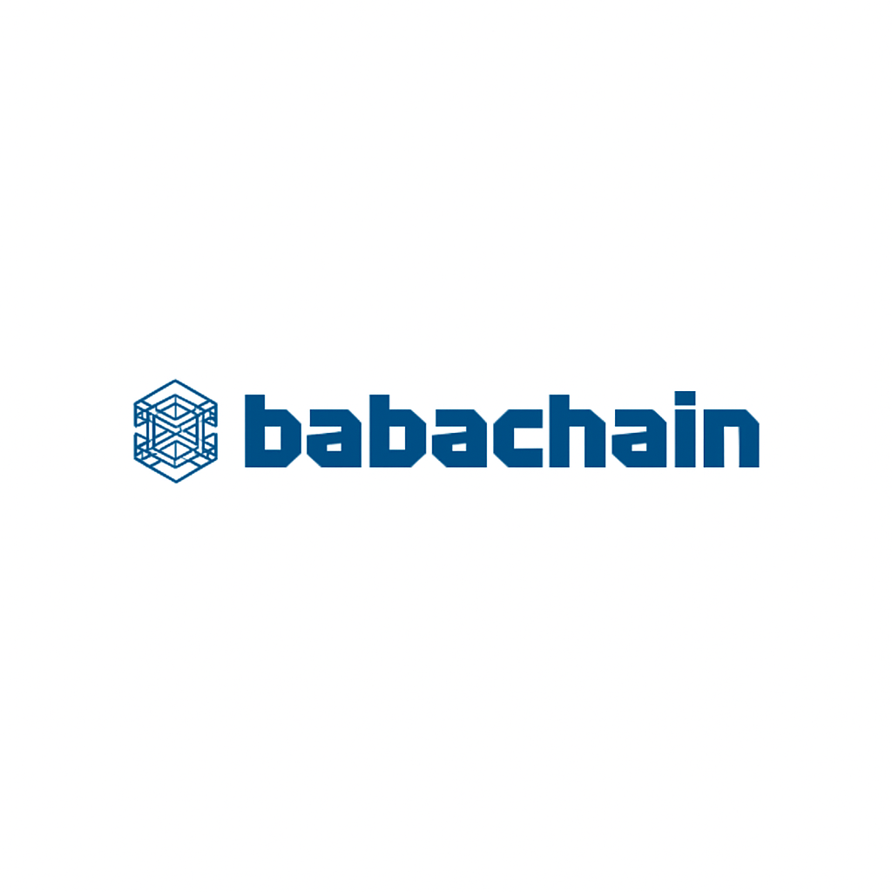

# 


[](https://github.com/baba-chain/babachain/tree/master)
[](https://opensource.org/licenses/MIT)

> Adil ekonomi ve sürdürülebilir ödüllerle yeni nesil Proof-of-Stake blok zinciri

## BabaChain Nedir?

BabaChain, sıfırdan Proof-of-Stake konsensüsü ile inşa edilmiş, enerji verimli, adil ve sürdürülebilir olacak şekilde tasarlanmış modern bir kripto para birimidir. Büyük ön madencilik veya adaletsiz dağıtıma sahip geleneksel kripto paralardan farklı olarak, BabaChain arzının %90'ını topluluk staking ödüllerine ayırır.

### 🚀 Temel Özellikler

- **⚡ Proof-of-Stake Konsensüsü** - Enerji verimli, hızlı ve güvenli
- **🎯 Adil Dağıtım** - Sadece %10 ön madencilik, %90 topluluk ödülleri için
- **📈 Kademeli Bonus Sistemi** - Stake büyüklüğüne dayalı pürüzsüz ödül ilerlemesi
- **🔒 Güvenli Staking** - Herhangi bir miktar stake edilebilir (1 BabaChain bile!)
- **⏱️ Hızlı Bloklar** - 2.5 dakika ortalama blok süresi
- **🌱 Sürdürülebilir** - Uzun vadeli ağ sağlığı için tasarlandı

## 📊 Ekonomi ve Arz

| Parametre | Değer |
|-----------|-------|
| **Başlangıç Arzı** | 210,000,000 BabaChain |
| **Maksimum Arz** | 1,000,000,000 BabaChain (sabit üst sınır) |
| **Ön Madencilik** | 20,000,000 (~%10) |
| **Başlangıç Staking Havuzu** | 190,000,000 (~%90) |
| **Genişletilmiş Staking Havuzu** | 790,000,000 (210M'den 1B'ye) |
| **Blok Süresi** | 2.5 dakika |
| **Staking ROI** | ~%365 yıllık (%1 günlük) + kademeli bonuslar |

### 💰 Ödüller Nasıl Çalışır

**Basit Formül**: Günlük ödülleriniz = Stake'iniz × %1 + Kademeli Bonus

**Karmaşık Matematik Yok**: Sadece stake'inizin günlük ~%1'ini kazanın, artı büyük stake'ler için bonuslar!

## 📥 Cüzdan İndirmeleri

### Resmi Cüzdanlar

| Platform | İndir | Versiyon | Boyut |
|----------|-------|----------|-------|
| **Windows** | [İndir](https://github.com/baba-chain/babachain/releases) | v1.0.0 | ~50MB |
| **macOS** | [İndir](https://github.com/baba-chain/babachain/releases) | v1.0.0 | ~45MB |
| **Linux** | [İndir](https://github.com/baba-chain/babachain/releases) | v1.0.0 | ~40MB |
| **Android** | [Google Play](https://play.google.com/store/apps/babachain) | Yakında | ~25MB |
| **iOS** | [App Store](https://apps.apple.com/app/babachain) | Yakında | ~30MB |

### Hızlı Başlangıç

#### Normal Kullanıcılar İçin (Önerilen)
1. **İndirin** platformunuz için cüzdanı
2. **Kurun** ve uygulamayı çalıştırın
3. **Oluşturun** yeni bir cüzdan veya mevcut olanı içe aktarın
4. **Alın** BabaChain ve hemen staking yapmaya başlayın!

#### Geliştiriciler İçin

### Ön Koşullar

- C++17 uyumlu derleyici
- CMake 3.16+
- Boost kütüphaneleri
- OpenSSL
- libevent

### Kaynaktan Derleme

#### Linux/macOS
```bash
git clone https://github.com/baba-chain/babachain.git
cd babachain
./autogen.sh
./configure
make -j$(nproc)
```

#### Windows
Detaylı talimatlar için [build-windows.md](doc/build-windows.md) dosyasına bakın.

### BabaChain'i Çalıştırma

```bash
# Daemon'u başlat
./src/babachaind

# GUI ile başlat
./src/qt/babachain-qt
```

## 🥩 Solo Staking - Havuz Gerekmez!

**Devrimci Otomatik Düğüm Sistemi!**
- Her cüzdan otomatik olarak bir ağ düğümü haline gelir
- Manuel kurulum yok - sadece kurun ve çalıştırın!
- Cüzdanınız BabaChain ağına otomatik bağlanır
- Otomatik olarak blok doğrulamasına katılır ve ödül kazanır
- Ne kadar çok kullanıcı katılırsa, ağ o kadar güçlü ve merkezi olmayan hale gelir
- Ödülleri doğrudan cüzdanınıza kazanın - havuz ücreti yok, aracı yok!

### 📱 Mevcut Cüzdanlar

| Platform | Durum | Özellikler |
|----------|-------|------------|
| **Masaüstü (Windows/Mac/Linux)** | ✅ Mevcut | Tam düğüm, staking, yönetişim |
| **Android** | 🔄 Yakında | Mobil staking, QR ödemeler |
| **iOS** | 🔄 Yakında | Mobil staking, bildirimler |
| **Web Cüzdan** | 📋 Planlandı | Tarayıcı tabanlı, hafif istemci |

### Başlarken

#### Masaüstü Staking
1. **İndirin** işletim sisteminiz için BabaChain cüzdanını
2. **Senkronize edin** blok zinciri ile (sadece ilk seferde)
3. **Transfer edin** BabaChain'i cüzdanınıza (herhangi bir miktar!)
4. **Bekleyin** coinlerin olgunlaşması için 8 saat
5. **Etkinleştirin** cüzdan ayarlarında staking'i
6. **Cüzdanı çevrimiçi tutun** ve kazanmaya başlayın!

#### Mobil Staking (Yakında)
1. **Kurun** BabaChain mobil uygulamasını
2. **Oluşturun** veya cüzdanınızı içe aktarın
3. **Stake edin** doğrudan telefonunuzdan
4. **Ödül kazanın** 7/24 arka plan staking ile
5. **Bildirim alın** blok bulduğunuzda

### 💰 Ne Kadar Kazanabilirsiniz? (Kademeli Bonus Sistemi!)

**🔥 MUHTEŞEM GETİRİLER**: Stake'inizin günlük ~%1'ini kazanın = ~%365 yıllık ROI + Kademeli Bonuslar!

**Günlük Ödül Örnekleri:**

| Stake'iniz | Temel Günlük (%1) | Kademeli Bonus | Toplam Günlük | Aylık | Yıllık | ROI |
|------------|-------------------|----------------|---------------|-------|--------|-----|
| **100 BabaChain** | 1.0 | +0.05 | 1.05 | 31.5 | 383 | **%383** |
| **1,000 BabaChain** | 10.0 | +0.5 | 10.5 | 315 | 3,833 | **%383** |
| **5,000 BabaChain** | 50.0 | +12.5 | 62.5 | 1,875 | 22,813 | **%456** |
| **10,000 BabaChain** | 100.0 | +50 | 150 | 4,500 | 54,750 | **%548** |
| **25,000 BabaChain** | 250.0 | +208 | 458 | 13,750 | 167,175 | **%669** |
| **50,000 BabaChain** | 500.0 | +625 | 1,125 | 33,750 | 410,625 | **%821** |
| **100,000 BabaChain** | 1,000.0 | +2,000 | 3,000 | 90,000 | 1,095,000 | **%1,095** |

### 🎯 Temel Noktalar:

✅ **Minimum Gereksinim Yok**: HERHANGİ bir miktarı stake edin (1 BabaChain bile çalışır!)
✅ **%1 Günlük Getiri**: Stake'iniz her gün ~%1 büyür
✅ **%365+ Yıllık ROI**: Herhangi bir banka veya yatırımı geçen inanılmaz getiriler
✅ **Kademeli Bonus Sistemi**: Büyük stake'ler kademeli olarak daha yüksek bonuslar alır
✅ **Havuz Ücreti Yok**: Ödüllerin %100'ü doğrudan size gider
✅ **Bileşik Büyüme**: Günlük ödülleri yeniden yatırarak üstel büyüme

### 🏆 Kademeli Bonus Sistemi (Pürüzsüz İlerleme):

**Sabit Kademeler Yok - Sürekli Bonus Büyümesi!**

- 💚 **1-10,000 BabaChain**: %0 ile %5 bonus (kademeli artış)
- 🚀 **10,000-100,000 BabaChain**: %5 ile %20 bonus (kademeli artış)
- 💎 **100,000+ BabaChain**: Maksimum %20 bonus

**Nasıl Çalışır:**
- Her ek BabaChain bonusunuzu hafifçe artırır
- Ani sıçramalar veya adaletsiz kademe kesintileri yok
- Pürüzsüz matematiksel ilerleme büyümeyi ödüllendirir
- Ne kadar çok stake ederseniz, günlük yüzdeniz o kadar yüksek

**Bonus Örnekleri:**
- **1,000 BabaChain**: ~%0.5 bonus = günlük %1.005 (%367 ROI)
- **5,000 BabaChain**: ~%2.5 bonus = günlük %1.025 (%374 ROI)
- **10,000 BabaChain**: %5 bonus = günlük %1.05 (%383 ROI)
- **25,000 BabaChain**: ~%8.3 bonus = günlük %1.083 (%395 ROI)
- **50,000 BabaChain**: ~%12.5 bonus = günlük %1.125 (%411 ROI)
- **75,000 BabaChain**: ~%16.7 bonus = günlük %1.167 (%426 ROI)
- **100,000 BabaChain**: %20 bonus = günlük %1.20 (%438 ROI)

### 📈 Gerçek Örnek:

**15,000 BabaChain stake ederseniz:**
- Temel günlük ödül: 150 BabaChain (%1)
- Kademeli bonus (~%5.6): +8.4 BabaChain
- **Toplam günlük**: 158.4 BabaChain
- **Aylık**: 4,752 BabaChain
- **Yıllık**: 57,816 BabaChain (**%385 ROI!**)

### 🚀 Bileşik Büyüme Örneği:

**10,000 BabaChain ile başlayın:**
- **1. Ay**: 10,000 → 14,500 (+4,500)
- **6. Ay**: 14,500 → 35,000+ (bonus artar!)
- **12. Ay**: 35,000+ → 150,000+ (**15x büyüme!**)

### 🌐 Ağ Büyümesi = Herkes Kazanır

**Ne Kadar Çok Kullanıcı, O Kadar Güçlü Ağ:**
- Her yeni cüzdan = Yeni ağ düğümü
- Daha fazla düğüm = Daha iyi güvenlik ve hız
- Daha büyük ağ = Daha yüksek BabaChain değeri
- Ağ büyüdükçe ödülleriniz de büyür!

**Viral Büyüme Mekanizmaları:**
- 📱 **Kolay Mobil Uygulamalar**: Herkes 30 saniyede staking yapmaya başlayabilir
- 🔄 **Otomatik Her Şey**: Teknik kurulum gerekmez
- 💰 **%365+ ROI**: İnanılmaz getiriler daha fazla kullanıcı çeker
- 🎯 **Referans Bonusları**: Arkadaş getirmek için ekstra kazanın
- 🏆 **Sosyal Özellikler**: Başarıları paylaşın, arkadaşlarla yarışın

### ⚡ BabaChain'in Otomatik Düğüm Sistemi Neden Devrimci

| Geleneksel Kripto | BabaChain Otomatik Düğüm Sistemi |
|-------------------|----------------------------------|
| ❌ Pahalı madencilik donanımı | ✅ Herhangi bir cihaz düğüm olur |
| ❌ Yüksek elektrik maliyetleri | ✅ Minimal enerji kullanımı |
| ❌ Havuz ücretleri (%1-3) | ✅ Ücret yok - %100 ödül |
| ❌ Karmaşık düğüm kurulumu | ✅ Sıfır kurulum - otomatik bağlanır |
| ❌ Merkezi madencilik havuzları | ✅ Her cüzdan = merkezi olmayan düğüm |
| ❌ Donanım eskir | ✅ Yazılım otomatik güncellenir |
| ❌ Teknik bilgi gerekir | ✅ Herkes katılabilir |
| ❌ Ağ azınlık tarafından kontrol edilir | ✅ Ağ her kullanıcıyla büyür |

### 🔧 Staking Gereksinimleri

**Temel Gereksinimler:**
- **Minimum Stake**: HERHANGİ bir miktar (1 BabaChain bile çalışır!)
- **Coin Olgunluğu**: Coin aldıktan sonra 8 saat bekleyin
- **Cüzdan Durumu**: Cüzdanı çevrimiçi ve kilitsiz tutun
- **İnternet**: BabaChain ağına kararlı bağlantı

**Kazancı Maksimize Etmek İçin:**
- **7/24 Çevrimiçi Kalın**: Daha fazla çalışma süresi = daha fazla ödül
- **Büyük Stake'ler**: Kademeli bonus artışları alın
- **Ödülleri Birleştirin**: Kazançları yeniden yatırarak stake'inizi büyütün
- **Güncel Kalın**: En son cüzdan versiyonunu kullanın

**Önemli Notlar:**
- ✅ Minimum stake gereksinimi yok (herhangi bir miktarı stake edin!)
- ✅ Havuz ücreti yok (ödüllerin %100'ü size gider)
- ✅ Pahalı donanım gerekmez
- ✅ Herhangi bir bilgisayar veya mobil cihazda çalışır

## 🔧 Yapılandırma

### babachain.conf Örneği
```ini
# Ağ
listen=1
server=1
daemon=1

# Staking
staking=1
stakeminconfirmations=1

# RPC
rpcuser=kullaniciadi
rpcpassword=sifreniz
rpcallowip=127.0.0.1
```

## 🧪 Test Etme

### Birim Testleri
```bash
make check
```

### Fonksiyonel Testler
```bash
test/functional/test_runner.py
```

## 📚 Dokümantasyon

- [Derleme Talimatları](doc/)
- [Yapılandırma Kılavuzu](doc/configuration.md)
- [API Referansı](doc/api.md)
- [Staking Kılavuzu](doc/staking.md)
- [Teknik Rapor](whitepaper.md)

## 📱 Mobil Cüzdan Özellikleri (Yakında)

### Android ve iOS Uygulamaları

**Devrimci Mobil Staking:**
- 🔋 **Arka Plan Staking**: Uygulama kapalıyken bile ödül kazanın
- 📊 **Gerçek Zamanlı İstatistikler**: Staking performansınızı izleyin
- 🔔 **Push Bildirimleri**: Blok bulduğunuzda uyarı alın
- 💸 **QR Ödemeler**: Kamera taramasıyla gönder/al
- 🔐 **Biyometrik Güvenlik**: Parmak izi ve Face ID desteği
- 🌐 **Çevrimdışı Mod**: İnternet olmadan bakiye ve geçmişi görüntüleyin
- 📈 **Portföy Takibi**: BabaChain değerinizi gerçek zamanlı takip edin

**Mobil Öncelikli Tasarım:**
- Tüm kullanıcılar için basit, sezgisel arayüz
- Tek dokunuşla staking aktivasyonu
- Ödül tahmini için yerleşik hesap makinesi
- Başarıları paylaşmak için sosyal özellikler
- Çoklu dil desteği

### Mobil Staking Neden Önemli

**Erişilebilirlik**: Akıllı telefonu olan herkes BabaChain kazanabilir
**Kolaylık**: Yolculuk, seyahat veya uyku sırasında stake edin
**Merkezi Olmama**: Daha fazla mobil staker = daha güçlü ağ
**Benimseme**: Kolay mobil erişim ana akım benimsenmeyi sağlar

## 🤝 Katkıda Bulunma

Katkıları memnuniyetle karşılıyoruz! Lütfen kılavuzlar için [CONTRIBUTING.md](CONTRIBUTING.md) dosyasına bakın.

### Geliştirme Süreci
1. Depoyu fork edin
2. Bir özellik dalı oluşturun
3. Değişikliklerinizi yapın
4. Uygunsa testler ekleyin
5. Bir pull request gönderin

## 🛡️ Güvenlik

BabaChain güvenliği ciddiye alır. Bir güvenlik açığı keşfederseniz, lütfen herkese açık bir sorun oluşturmak yerine security@babachain.org adresine e-posta gönderin.

## 📄 Lisans

BabaChain Core, [MIT Lisansı](LICENSE) altında yayınlanmıştır.

## 🌐 Topluluk

- **Web Sitesi**: https://www.babachain.org
- **Discord**: https://discord.gg/babachain
- **Twitter**: https://twitter.com/babachainorg
- **Telegram**: https://t.me/babachain
- **Reddit**: https://reddit.com/r/babachain

## ⚠️ Sorumluluk Reddi

BabaChain deneysel bir yazılımdır. Riski size aittir. Herhangi bir kripto para birimine yatırım yapmadan önce her zaman kendi araştırmanızı yapın.

---

**BabaChain Topluluğu tarafından ❤️ ile inşa edildi**